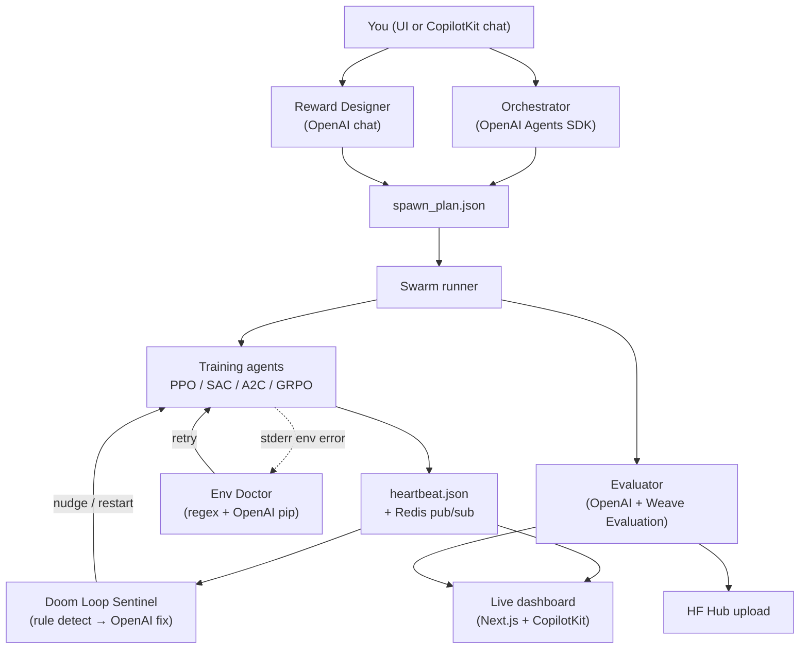

# Auto-RL

**Multi-agent reinforcement learning orchestration** — describe an RL task in natural language, and a swarm of agents plans, trains, monitors, and ranks competing policies.

Auto-RL is built around four pillars:

- **[OpenAI](https://platform.openai.com/)** — every decision-making agent (planning, recovery, evaluation, reward design) is an LLM call, wired through the [OpenAI Agents SDK](https://github.com/openai/openai-agents-python) or the OpenAI Python client.
- **[Weave](https://wandb.ai/site/weave)** — every agent action and training run is traced so you can inspect the full call tree in the W&B UI: what the orchestrator proposed, what the sentinel changed, and how each policy performed.
- **[Redis](https://redis.io/)** *(optional)* — pub/sub heartbeats and run-state persistence so the live dashboard stays in sync even if the backend restarts; without Redis, the same logic falls back to files on disk.
- **[CopilotKit](https://www.copilotkit.ai/)** — wraps the Next.js UI in a conversational runtime so you can also drive the pipeline from chat (`generate_plan`, `start_training`, …) in addition to the visual dashboard.

Built for [WeaveHacks](https://wandb.ai).

---

## What it does

1. **Orchestrator** — an OpenAI agent reads your task (e.g. *"Race PPO vs SAC on HalfCheetah-v5"*) and writes `spawn_plan.json`: a lineup of algorithms, environments, hyperparameters, and time budgets.
2. **Swarm runner** — launches every agent in parallel as subprocesses (local Mac CPU/MPS or RunPod GPU for GRPO).
3. **Training** — Stable-Baselines3 (PPO / SAC / A2C) on Gymnasium envs, or TRL GRPO on the Countdown math task. Each script streams metrics to Weave and writes a heartbeat every 60 s.
4. **Live UI** — heartbeats, reward charts, and a leaderboard update in near real time (Redis SSE when available, polling otherwise).
5. **Self-healing agents** — the **Env Doctor** fixes missing packages; the **Doom Loop Sentinel** detects NaN loss or plateau and asks GPT for a new hyperparameter config before restarting.
6. **Evaluator** — ranks finished runs with an OpenAI call plus a **Weave Evaluation** pass that scores return and stability.
7. **Export** — optional push of the winning checkpoint to **Hugging Face Hub** with a copy-paste usage snippet.

---

## Agents & orchestration

Auto-RL is not a single monolithic trainer — it is a **pipeline of specialized agents** that coordinate through shared files (`spawn_plan.json`, `heartbeat.json`, …) and, when Redis is enabled, through pub/sub channels. The **swarm runner** is the conductor: it starts training subprocesses, runs the Sentinel in the background, and collects results when the race finishes.



### Phase 1 — Planning

| Agent | Role | OpenAI usage | Weave |
|-------|------|--------------|-------|
| **Orchestrator** | Turns a natural-language task into a diverse `spawn_plan.json` (algo, env, hparams, time budget, local vs RunPod). Reads past run history from Redis when available so it avoids configs that previously NaN'd. | OpenAI Agents SDK (`Agent` + structured JSON output) | `@weave.op(name="Orchestrator")` |
| **Reward Designer** | Optional multi-turn chat before launch. Proposes a Python `reward_fn` that wraps the native Gym reward during SB3 training. | OpenAI chat completions | — |

You review and edit the plan in the UI (or approve it in CopilotKit chat) before anything trains.

### Phase 2 — Racing

| Component | Role | OpenAI usage | Weave |
|-----------|------|--------------|-------|
| **Swarm runner** | Async launcher. Starts one **training agent** subprocess per plan entry, plus the Sentinel task. Waits for all agents to finish or time out. | — | `weave.init` on startup |
| **Training agent** | Thin wrapper around `train_ppo.py` / `train_sac.py` / `train_a2c.py` / RunPod GRPO. Retries up to 3× on environment errors (delegates to Env Doctor). Applies Sentinel restarts with new hparams. | — | Per-step logs via `WeaveLogCallback` |
| **Doom Loop Sentinel** | Rule-based detection (NaN loss, stale heartbeat, entropy collapse) → **LLM intervention**. Writes `nudge.json` for soft fixes or kills and relaunches with GPT-suggested hparams (one restart max). | OpenAI Agents SDK | `@weave.op(name="SentinelLLM")` |
| **Env Doctor** | When stderr looks like a missing dependency (`ale_py`, Box2D, MuJoCo, …), runs `pip install …`. Regex fast-path first; falls back to GPT-suggested install commands. | OpenAI Agents SDK | `@weave.op(name="EnvDoctor")` |

Each training script writes `heartbeat.json` every 60 s. The Sentinel reads these (via Redis pub/sub for instant NaN detection, or by polling files every 30 s without Redis).

### Phase 3 — Evaluation & export

| Agent | Role | OpenAI usage | Weave |
|-------|------|--------------|-------|
| **Evaluator** | Ranks SB3 and GRPO results separately (different return scales). Produces structured rankings for the UI. | OpenAI chat | `weave.Evaluation` + `ReturnScorer` |
| **Reporter** | Writes `run_report.md` — a human-readable race summary. | — | — |
| **HF push** | Uploads the best checkpoint to Hugging Face Hub if `HF_TOKEN` is set. | — | — |

After a race, completed results are also written to **Redis run history** (`autorl:history:{algo}:{env}`) so the next Orchestrator call can learn from what worked.

### Training agents vs. control agents

It helps to separate two kinds of "agents" in the codebase:

- **Training agents** (`agent_1`, `agent_2`, …) — actual RL policies being trained. Each is a subprocess running SB3 or GRPO. They are *not* LLMs; they produce `model.zip` and `eval_result.json`.
- **Control agents** — LLM-powered services that manage the race: Orchestrator, Sentinel, Env Doctor, Reward Designer, Evaluator. These never touch gradients directly; they read/write JSON artifacts and spawn or kill training subprocesses.

The FastAPI backend (`ui/agent/middleware.py`) sits in the middle: it receives requests from the Next.js UI and CopilotKit, calls the Orchestrator, starts the swarm, streams heartbeats, and triggers evaluation + HF upload when the race ends.

---

## Features

| Component | Description |
|-----------|-------------|
| **Orchestrator** | OpenAI agent → `spawn_plan.json` from a natural-language task |
| **Swarm runner** | Async launcher; runs Sentinel + Env Doctor in the background |
| **PPO / SAC / A2C** | MuJoCo, Classic Control, Box2D, Atari (via `ale_py`), Toy Text |
| **GRPO / Countdown** | Language-model RL on arithmetic puzzles (local MPS or RunPod) |
| **Reward designer** | Multi-turn OpenAI chat to shape custom `reward_fn` per agent or globally |
| **Doom Loop Sentinel** | Detects NaN / plateau / critic divergence → OpenAI-suggested restart |
| **Env Doctor** | `pip install` fixes for missing deps (ALE, Box2D, MuJoCo, etc.) |
| **Evaluator + reporter** | OpenAI rankings + Weave Evaluation + `run_report.md` |
| **HuggingFace push** | Upload winner to `autorl-{name}-{timestamp}` with model card |
| **Video inference** | Render trained policies to MP4 (MuJoCo, Atari, grid worlds, …) |
| **CopilotKit UI** | Conversational actions alongside the visual race dashboard |
| **Redis coordination** | Optional pub/sub heartbeats, nudge queues, run history for the orchestrator |

> **World-model / custom-dataset pipeline** lives on the `feat/world-model-custom-RL` branch (train a neural simulator from HF datasets, then race PPO/SAC/A2C inside it).

---

## The stack

### OpenAI — the brain of every control agent

OpenAI models power all LLM-driven decisions in the pipeline. Different agents use different SDKs depending on what they need:

| Agent | SDK / API | What it decides |
|-------|-----------|-----------------|
| Orchestrator | [OpenAI Agents SDK](https://github.com/openai/openai-agents-python) (`Agent` + `Runner`) | Which algorithms, envs, and hyperparameters to race |
| Doom Loop Sentinel | OpenAI Agents SDK | New lr / seed / n_steps after a failure |
| Env Doctor | OpenAI Agents SDK | Which `pip install` command fixes a missing dep |
| Reward Designer | OpenAI Python client | Python `reward_fn` code from your chat |
| Evaluator | OpenAI Python client | Natural-language ranking of finished runs |
| CopilotKit chat | CopilotKit `OpenAIAdapter` | Which UI action to call (`generate_plan`, `start_training`, …) |

Set `OPENAI_API_KEY` in `.env`. Override the model per agent with `OPENAI_MODEL` (Orchestrator and Sentinel default to `gpt-5.4-mini-2026-03-17`; others default to `gpt-4o-mini`).

### Weave — full observability across the pipeline

[Weave](https://wandb.ai/site/weave) is W&B's tracing layer. With `WANDB_API_KEY` set, every major step is logged to your Weave project (`WEAVE_PROJECT`, default `autorl`):

- **Agent ops** — `@weave.op` decorators on Orchestrator, Sentinel, Env Doctor, and RunPod provisioning give you a trace tree of every LLM call and its inputs/outputs.
- **Training metrics** — `WeaveLogCallback` in SB3 scripts logs rolling episode return, entropy, and critic loss every 1 000 steps.
- **Evaluation** — after a race, the Evaluator runs a `weave.Evaluation` with a `ReturnScorer` that scores each agent by mean return and stability. Results appear in the Weave Evaluations tab.
- **GRPO** — Countdown training logs generation-level metrics through Weave's current-call API.

Weave and W&B charts are independent — disable either with `WEAVE_DISABLED=1` or `WANDB_DISABLED=1`.

### Redis — real-time coordination (optional)

Redis is a **performance and persistence layer**, not a hard dependency. `coordination/redis_coordinator.py` wraps all Redis calls with a transparent file fallback — local dev works with zero Redis setup.

When `REDIS_URL` is set:

| Feature | Redis key / channel | Why it matters |
|---------|---------------------|----------------|
| Live heartbeats | `autorl:heartbeat:{run_id}` pub/sub | UI SSE stream updates instantly; Sentinel detects NaN in seconds instead of polling every 30 s |
| Nudge queue | `autorl:nudge:{run_id}:{agent_id}` | Sentinel pushes lr adjustments; training script pops them atomically |
| Run state | `autorl:run:{run_id}` | Backend survives restarts — UI reconnects to in-progress races |
| Run history | `autorl:history:{algo}:{env}` sorted set | Orchestrator reads top past configs and avoids known-bad hyperparameters |
| Race dropout | peer heartbeat comparison | Slow agents exit early when far behind the leader, freeing compute |

Training scripts still write `heartbeat.json` to disk regardless — Redis mirrors that data for subscribers. Set `REDIS_DISABLED=1` to skip Redis entirely.

### CopilotKit — conversational control of the pipeline

The Next.js app wraps everything in a [CopilotKit](https://www.copilotkit.ai/) runtime (`ui/app/layout.tsx`). Server-side actions in `ui/app/api/copilotkit/route.ts` expose four tools the chat LLM can call:

1. **`generate_plan`** → `POST /api/plan` — create a spawn plan from your task
2. **`start_training`** → `POST /api/run` — launch the swarm after approval
3. **`get_status`** → `GET /api/status/{run}` — poll live heartbeats
4. **`get_results`** → `GET /api/results/{run}` — fetch final rankings

The primary UI (`HomePage.tsx`) calls the same FastAPI backend directly — buttons, charts, and the reward-design chat do not require CopilotKit. CopilotKit is the **conversational alternative**: you can describe a task in chat and the LLM picks the right action. Both paths hit the same Python backend at `:8000`.

---

## Prerequisites

| Tool | Version |
|------|---------|
| Python | ≥ 3.12 |
| Node.js | ≥ 20 |
| npm | ≥ 10 |

Optional: **Redis** for SSE heartbeats across backend restarts; **RunPod** account for cloud GRPO; **HuggingFace** token for model upload.

---

## Setup

### 1 — Clone and Python environment

```bash
cd autorl
python3.12 -m venv .venv
source .venv/bin/activate
pip install -r requirements.txt
```

Verify MuJoCo (optional but recommended):

```bash
python -c "import gymnasium; e=gymnasium.make('HalfCheetah-v5'); e.reset(); print('OK')"
```

Box2D (LunarLander, etc.) needs `swig` — already listed in `requirements.txt`.

### 2 — Environment variables

```bash
cp .env.template .env
```

| Key | Required | Purpose |
|-----|----------|---------|
| `OPENAI_API_KEY` | ✅ | Orchestrator, Sentinel, Env Doctor, Reward designer, Evaluator |
| `WANDB_API_KEY` | ✅ | Weave tracing + W&B charts |
| `HF_TOKEN` | optional | Push winning model to Hugging Face Hub |
| `RUNPOD_API_KEY` | optional | Cloud GPU for GRPO agents |
| `REDIS_URL` | optional | Real-time SSE; file fallback works without it |
| `REDIS_DISABLED=1` | optional | Force file-based heartbeats (recommended for local dev if Redis is unreachable) |
| `WEAVE_PROJECT` | optional | Weave project name (default: `autorl`) |
| `OPENAI_MODEL` | optional | Override LLM model (default in orchestrator: `gpt-5.4-mini-2026-03-17`) |

Never commit `.env` — it is git-ignored.

### 3 — UI (Node.js)

```bash
cd autorl/ui
npm install
```

---

## Running (UI — recommended)

**Terminal 1** — FastAPI backend:

```bash
cd autorl
bash ui/agent/start.sh
# → http://localhost:8000  (health: GET /health)
```

**Terminal 2** — Next.js frontend:

```bash
cd autorl/ui
npm run dev
# → http://localhost:3000
```

### End-to-end flow

1. Open **http://localhost:3000**
2. Enter a task, e.g. *"Train the best MuJoCo locomotion policy"* or *"Race PPO and A2C on ALE/Pong-v5"*
3. Click **generate lineup** — the Orchestrator (OpenAI) builds an agent plan (~10–20 s); the call is traced in Weave
4. **Review the lineup** — edit or remove agents, set an optional HuggingFace model name
5. **(Optional) Design reward** — open the AI chat to shape a custom `reward_fn` with the Reward Designer; approve to attach it to agents
6. Click **launch race** — the swarm runner starts all training agents in parallel; heartbeats stream to the UI via Redis SSE (or polling)
7. **Live dashboard** — per-agent cards (steps, reward chart, infer button), leaderboard, sentinel/doctor logs
8. **During the race** — the Sentinel watches heartbeats and may nudge or restart agents via OpenAI; use the **reward functions** panel (bottom-right) to view or edit per-agent rewards (applies on next run)
9. **When done** — the Evaluator ranks agents (OpenAI + Weave Evaluation), optional HF upload, inference video, copy-paste usage snippet

Alternatively, use the **CopilotKit chat** to drive the same flow conversationally (`generate_plan` → approve → `start_training` → `get_status` → `get_results`).

The UI persists an active run in `localStorage` — refreshing the page reconnects to an in-progress race (Redis run state helps the backend recover too).

---

## Running (CLI)

```bash
cd autorl
source .venv/bin/activate

# Step 1: generate spawn plan
python orchestrator/orchestrator_agent.py "Race PPO vs SAC on HalfCheetah-v5"

# Step 2: run the swarm (reads runs/latest/spawn_plan.json)
python orchestrator/swarm_runner.py
```

Each run creates `runs/YYYY-MM-DDTHH-MM-SS/` with a symlink `runs/latest`.

---

## Custom reward functions

The **Reward Designer** (`agents/reward_designer_agent.py`) helps you write Python reward shaping code:

```python
def reward_fn(obs, action, reward, terminated, truncated, info):
    return float(reward)  # modify as needed; np is available
```

- Design globally before launch (**design reward** on the plan screen), or per-agent from the live race sidebar.
- On launch, approved code is written to `{run_dir}/custom_reward.py` and applied via `training/reward_wrapper.py` during SB3 training.
- Validate via `POST /api/approve-spawn-reward`.

---

## Agentic recovery

See [Agents & orchestration](#agents--orchestration) for the full picture. In short:

### Doom Loop Sentinel (`agents/sentinel.py`)

Rule-based detection, OpenAI-driven recovery. Monitors heartbeats (Redis pub/sub when available, else file polling every 30 s):

- NaN loss / critic divergence → kill + OpenAI-suggested hyperparameter restart (max one restart, then permanent kill)
- Plateau / entropy collapse → nudge (lr adjustment via `nudge.json`, delivered through Redis or disk)
- All interventions logged to `runs/latest/sentinel_log.json` and traced as `@weave.op(name="SentinelLLM")`

### Env Doctor (`agents/env_doctor_agent.py`)

When a training subprocess fails with stderr matching environment errors (missing `ale_py`, Box2D, etc.):

- Fast path: regex → `pip install …`
- Slow path: OpenAI Agents SDK suggests install commands
- Retries up to 3 times; does **not** handle NaN/divergence (Sentinel owns that)

Log: `runs/latest/doctor_log.json`

---

## Render a trained policy

```bash
cd autorl
source .venv/bin/activate

python model_viewer/render_mujoco.py \
  --checkpoint runs/latest/agent_1/model.zip \
  --env-id HalfCheetah-v5 \
  --algo PPO \
  --output runs/latest/renders/agent_1.mp4
```

Or from the UI: click **infer** on any agent card (records an MP4 served at `/api/video/…`).

GRPO / Countdown agents use `model_viewer/countdown_inference.py` and show before/after accuracy in the UI instead of video.

---

## Hugging Face model upload

Set `HF_TOKEN` in `.env` (write access). Optionally set a **HuggingFace model name** on the plan screen before launch.

After the race, the backend pushes the best checkpoint to:

```
https://huggingface.co/{username}/autorl-{your-name}-{YYYYMMDD-HHMMSS}
```

The done screen shows the repo URL and a standalone Python snippet. Upload logic: `training/hf_utils.py`.

---

## API reference (backend)

| Method | Path | Description |
|--------|------|-------------|
| GET | `/health` | Health check |
| POST | `/api/plan` | `{ task }` → spawn plan + run_dir |
| POST | `/api/run` | `{ task, run_dir, plan, hf_model_name? }` → start swarm |
| GET | `/api/status/{run}` | Heartbeats, sentinel/doctor logs, plan |
| GET | `/api/stream/{run}` | SSE heartbeat stream (falls back to polling if no Redis) |
| GET | `/api/results/{run}` | Final results, best agent, HF URL, rankings |
| POST | `/api/infer` | Render agent policy to MP4 |
| POST | `/api/cancel/{run}` | Stop a running race |
| POST | `/api/design-spawn-reward` | One turn of reward-design chat |
| POST | `/api/approve-spawn-reward` | Validate reward Python code |
| GET | `/api/inference/{run}/{agent}` | GRPO before/after showcase JSON |

---

## Run artifacts

Each agent directory `runs/latest/{agent_id}/`:

| File | Contents |
|------|----------|
| `heartbeat.json` | Live status (steps, reward, anomaly flags) |
| `eval_result.json` | Final metrics, checkpoint path, status |
| `model.zip` | SB3 checkpoint (or GRPO adapter weights) |
| `nudge.json` | Pending lr nudge from Sentinel (if any) |

Run-level files:

| File | Contents |
|------|----------|
| `spawn_plan.json` | Approved agent lineup |
| `custom_reward.py` | Shared reward function (if designed) |
| `sentinel_log.json` | Sentinel intervention history |
| `doctor_log.json` | Env Doctor fix attempts |
| `run_report.md` | Human-readable race summary |

Pydantic schemas: `orchestrator/orchestrator_agent.py` and `autorl/SCHEMA.md`.

---

## Project structure

```
Auto-RL/
├── README.md
├── docs/                          # Design docs & build guides
└── autorl/
    ├── orchestrator/
    │   ├── orchestrator_agent.py  # LLM → spawn_plan.json
    │   ├── swarm_runner.py        # async multi-agent launcher
    │   └── device.py              # cpu / mps / runpod resolution
    ├── agents/
    │   ├── sentinel.py            # Doom Loop Sentinel
    │   ├── env_doctor_agent.py    # missing-dep auto-fix
    │   ├── reward_designer_agent.py
    │   └── training_agent.py      # subprocess wrapper + doctor retries
    ├── training/
    │   ├── train_ppo.py / train_sac.py / train_a2c.py
    │   ├── train_grpo_countdown.py
    │   ├── env_utils.py           # env creation + wrappers
    │   ├── reward_wrapper.py      # custom reward_fn at train time
    │   ├── hf_utils.py            # HuggingFace Hub upload
    │   └── callbacks/             # heartbeat + Weave logging
    ├── evaluator/
    │   ├── evaluator_agent.py     # LLM + Weave ranking
    │   └── reporter.py            # run_report.md generator
    ├── coordination/
    │   └── redis_coordinator.py   # optional Redis pub/sub
    ├── model_viewer/              # MP4 rendering + GRPO inference
    ├── pod_manager/               # RunPod GPU provisioning
    ├── ui/
    │   ├── agent/middleware.py    # FastAPI backend (:8000)
    │   ├── agent/start.sh
    │   └── components/HomePage.tsx
    ├── runs/                      # created at runtime; latest → symlink
    ├── .env.template
    └── requirements.txt
```

---

## Observability quick reference

| What | Where |
|------|-------|
| LLM call traces (Orchestrator, Sentinel, Env Doctor) | Weave → Ops tab |
| Training curves (episode return, entropy, critic loss) | Weave logs + W&B charts |
| Post-race scoring | Weave → Evaluations tab |
| Live race state | UI dashboard + `GET /api/stream/{run}` (Redis SSE) |
| Intervention history | `sentinel_log.json`, `doctor_log.json` |
| Human-readable summary | `run_report.md` |

Disable Weave for quick local tests: `WEAVE_DISABLED=1 bash ui/agent/start.sh`

---

## Troubleshooting

| Problem | Fix |
|---------|-----|
| `backend running?` in UI | Start `bash ui/agent/start.sh` from `autorl/` |
| Redis connection errors | Set `REDIS_DISABLED=1` in `.env` — file fallback works fine locally |
| ALE / Atari env fails | Env Doctor should install `ale_py`; or `pip install ale-py` |
| Box2D env fails | `pip install swig gymnasium[box2d]` |
| MuJoCo render fails | Ensure `gymnasium[mujoco]` installed; inference runs in a subprocess for OpenGL |
| HF upload skipped | Set `HF_TOKEN`; winner must have `status` in `completed`, `early_stopped`, or `race_dropout` |
| Custom reward not applied | Reward is written at launch; edits during a race apply to the **next** run |

---

## Further reading

- [AutoRL_Project_Document.md](docs/AutoRL_Project_Document.md) — full system design
- [AutoRL_PersonA_Build_Guide.md](docs/AutoRL_PersonA_Build_Guide.md) — orchestrator & training
- [AutoRL_PersonB_Build_Guide.md](docs/AutoRL_PersonB_Build_Guide.md) — UI & integration
- [autorl/SCHEMA.md](autorl/SCHEMA.md) — JSON file schemas

---

## License

See repository license. Built during WeaveHacks 4 by Dhyuti and Arjun
